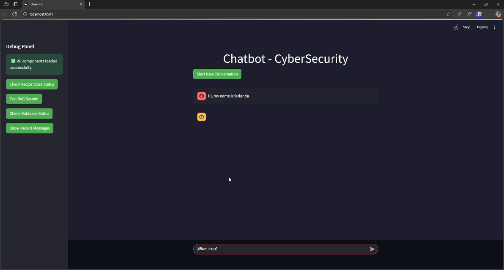
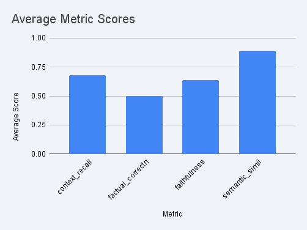

# CyberSecurity LLM RAG System

A Retrieval-Augmented Generation (RAG) chatbot specialized in cybersecurity, built with Streamlit and CLI interfaces. The system uses FAISS vector store for document retrieval and Ollama for local LLM inference.



## 📋 Prerequisites

- Python 3.8+
- [Ollama](https://ollama.ai/) installed and running
- Required Ollama models:
  - `llama3.2:latest` (for chat)
  - `nomic-embed-text` (for embeddings)

### Install Ollama Models
```bash
ollama pull llama3.2:latest
ollama pull nomic-embed-text
```

## 🚀 Installation

## Docker (Easy Installation)

```bash
./start.sh
```

## Vanilla

1. **Clone the repository**
```bash
git clone <repository-url>
cd cybersec-llm
```

2. **Create virtual environment**
```bash
python -m venv cybersec-venv
source cybersec-venv/bin/activate  # On Windows: cybersec-venv\Scripts\activate
```

3. **Install dependencies**
```bash
pip install -r req.txt
```

## 🗃️ Data Preprocessing

Before using the chatbot, you need to create the vector store from cybersecurity datasets.

### Run Preprocessing
```bash
cd preprocess_rag
python preprocess.py
```

**What it does:**
- Downloads cybersecurity datasets (SecQA v1/v2, Cybersecurity Dataset v1)
- Cleans and preprocesses the data
- Creates document chunks (1000 chars with 100 overlap)  
- Generates embeddings using `nomic-embed-text`
- Saves FAISS vector store to `db/vectors/`

**Expected output:**

Loading datasets...
Successfully merged 2 datasets
Final dataset size: X,XXX samples
Converting to documents...
Chunking documents...
Creating vector store... This may take a while
Successfully saved vector store to db/vectors


## 💬 Running the Chatbot

### Streamlit Web Interface

```bash
streamlit run chatbot.py
```

**Features:**
- Web-based chat interface
- Real-time streaming responses
- Chat history persistence
- Debug panel with system status
- Dark theme cybersecurity styling

**Access:** Open your browser to `http://localhost:8501`

### Command Line Interface

```bash
python cli_chat.py --user-id your_username
```

**Options:**
```bash
python cli_chat.py --help

Options:
  --user-id USER_ID              User session ID (default: cli_user)
  --db-path DB_PATH              SQLite database path (default: db/sqlite/chat_history.db)
  --vector-store-path VECTOR_PATH FAISS vector store path (default: db/vectors)
  --status                       Show system status and exit
  --history                      Show chat history and exit
```

**CLI Commands:**
- `history` - Show recent conversation
- `clear` - Start new conversation
- `quit`/`exit`/`bye` - Exit chat
- `Ctrl+C` - Force exit

## 📊 Evaluation

### RAGAS Evaluation

Evaluate the RAG system using RAGAS metrics (requires Google API key):



**Key Metrics:**
- **Semantic Similarity:** 0.89 ± 0.04 - High consistency in response relevance
- **Context Recall:** 0.68 ± 0.30 - Good context retrieval with some variability  
- **Factual Correctness:** 0.50 ± 0.26 - Mixed accuracy, room for improvement
- **Faithfulness:** 0.64 ± 0.37 - Generally faithful to context with occasional deviations

```bash
cd eval
python ragas_evaluator.py \
  --csv_file path/to/evaluation_data.csv \
  --output_file results/ragas_result.csv \
  --sample_size 100
```

**Metrics evaluated:**
- LLM Context Recall
- Factual Correctness  
- Faithfulness
- Semantic Similarity

### Simple RAG vs Non-RAG Comparison

Compare model performance with and without RAG:

```bash
cd eval
python simple_comparison.py
```

**What it does:**
1. Evaluates model WITH RAG on pentest dataset
2. Saves questions that were answered (not refused)
3. Evaluates model WITHOUT RAG on same questions  
4. Compares accuracy and saves results

**Output files:**
- `results/simple_comparison_YYYYMMDD_HHMMSS.csv` - Detailed results
- `results/simple_comparison_summary_YYYYMMDD_HHMMSS.txt` - Summary stats

## 📁 Database Structure

### SQLite Chat History
- **Location:** `db/sqlite/chat_history.db`
- **Schema:** user_id, role (user/assistant), content, timestamp

### FAISS Vector Store  
- **Location:** `db/vectors/`
- **Files:**
  - `index.faiss` - FAISS index
  - `index.pkl` - Document metadata

## 🔍 Troubleshooting

### Common Issues

1. **"No module named 'llm'"**
   - Ensure you're running from the project root directory
   - Check that `llm/__init__.py` exists

2. **"Vector store not found"**
   - Run preprocessing first: `python preprocess_rag/preprocess.py`
   - Check that `db/vectors/` directory exists

3. **"Ollama connection failed"**
   - Ensure Ollama is running: `ollama serve`
   - Verify models are installed: `ollama list`

4. **Streamlit port already in use**
   - Use different port: `streamlit run chatbot.py --server.port 8502`

### System Status Check

```bash
python cli_chat.py --status
```

This shows:
- Vector store status and document count
- Database connection status  
- Current session message count

## 🎯 Key Features

- **RAG-Enhanced Responses:** Retrieves relevant cybersecurity knowledge
- **Multiple Interfaces:** Web (Streamlit) and CLI options
- **Persistent Memory:** Chat history saved across sessions
- **Real-time Streaming:** Live response generation
- **Comprehensive Evaluation:** RAGAS and custom comparison metrics
- **Debug Tools:** System status monitoring and testing

## 📝 Configuration

### Environment Variables

Create `.env` file for API keys (optional):
```bash
GOOGLE_API_KEY=your_google_api_key  # For RAGAS evaluation
```

### Default Paths

- Vector Store: `db/vectors/`
- Chat Database: `db/sqlite/chat_history.db` 
- Evaluation Results: `eval/results/`

## 🤖 Models Used

- **Chat LLM:** `llama3.2:latest` (via Ollama)
- **Embeddings:** `nomic-embed-text` (via Ollama)  
- **Evaluation:** `gemini-2.0-flash` (via Google API)

## 📊 Performance

The system is optimized for:
- Local inference (no external API dependencies for chat)
- Efficient vector similarity search
- Streaming responses for better UX
- Persistent chat history

---

## 🚦 Quick Start

1. Install Ollama and pull models
2. Install Python dependencies
3. Run preprocessing: `python preprocess_rag/preprocess.py`
4. Start chatbot: `streamlit run chatbot.py` or `python cli_chat.py`
5. Ask cybersecurity questions!

For evaluation: Configure Google API key and run evaluation scripts in `eval/` directory.

